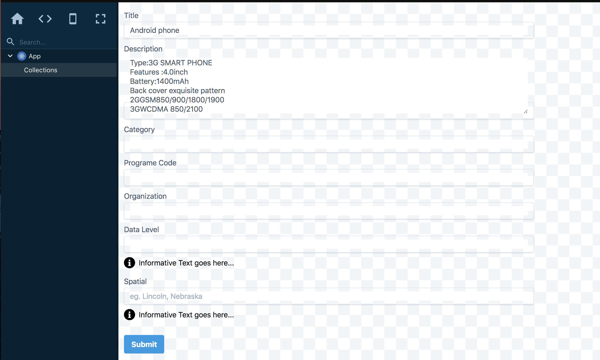

# GSA inventory app read me

This is just copied from the readme of the previous work... So take with a big pinch of salt 

## Quick Start
To sample the application run:
`yarn && yarn start`

You should see:


## Bundling the app
To output as a single file (best for compatibility with fanstatic and CKAN) run:

`yarn build:bundle`

This will create a loadable script at `/dist/build/static/js/bundle.min.js`

To use the standard react-scripts/create-react-app build script run:
`yarn build`

This will create a manifest and a multi-file build as per normal for create-react-app

## Embedding the app
For an example of how to embed the app see `pubic/index.html`

Add a div element as follows... note that data-config values can be changed as per (config)[#config]
```html
<div id="dep-of-ed-admin-ui" data-config='{"apiUrl": "http://localhost:5000/api/3/acti    on/", "debug": true, "collectionId": "ppp", "isMaster": true}'></div>
```

This should work :)

## config
*isMaster*: _bool_ - whether or not this is a master collection
*apiUrl*: _url_ - fully qualified URL pointing to ckan API -- _include trailing slash_
*addDocsUrl*: _url_ - base path to admin form to add resources to summary dataset; note the colleciton id will be appended to this
*debug*: _bool_ - Enable debug mode

## Empty create form
* Instantiate (as above)[#Embedding the app] without passing `collectionId`
* Make sure to include `isMaster` value to instantiate the master collections form

## Cosmos
For development you can use [cosmos](https://github.com/react-cosmos/react-cosmos)

Cosmos fixtures are located in the `__fixtures__` directory

To preview component with cosmos:
`yarn && yarn cosmos` 

You should see:


This project was bootstrapped with [Create React App](https://github.com/facebook/create-react-app).

## Tests

`yarn test`

TODO - better test coverage :)

## Extras

Many fields are stored in CKAN's "Extras".

This requires the App's API layer (`src/Api.js`) to map form fields to the extras fields format.

**If you add another Extras field you need to add it to the `EXTRAS` array at the top of Api.js`

## Stay tuned:

* Internal routing
* Multiple collections/groups
* Other CKAN administrative tasks
* A more complete es6 CKAN API interface

----
# Create React App Docs
## Available Scripts

In the project directory, you can run:

### `npm start`

Runs the app in the development mode.<br>
Open [http://localhost:3000](http://localhost:3000) to view it in the browser.

The page will reload if you make edits.<br>
You will also see any lint errors in the console.

### `npm test`

Launches the test runner in the interactive watch mode.<br>
See the section about [running tests](https://facebook.github.io/create-react-app/docs/running-tests) for more information.

### `npm run build`

Builds the app for production to the `build` folder.<br>
It correctly bundles React in production mode and optimizes the build for the best performance.

The build is minified and the filenames include the hashes.<br>
Your app is ready to be deployed!

See the section about [deployment](https://facebook.github.io/create-react-app/docs/deployment) for more information.

### `npm run eject`

**Note: this is a one-way operation. Once you `eject`, you can’t go back!**

If you aren’t satisfied with the build tool and configuration choices, you can `eject` at any time. This command will remove the single build dependency from your project.

Instead, it will copy all the configuration files and the transitive dependencies (Webpack, Babel, ESLint, etc) right into your project so you have full control over them. All of the commands except `eject` will still work, but they will point to the copied scripts so you can tweak them. At this point you’re on your own.

You don’t have to ever use `eject`. The curated feature set is suitable for small and middle deployments, and you shouldn’t feel obligated to use this feature. However we understand that this tool wouldn’t be useful if you couldn’t customize it when you are ready for it.

## Learn More

You can learn more in the [Create React App documentation](https://facebook.github.io/create-react-app/docs/getting-started).

To learn React, check out the [React documentation](https://reactjs.org/).

### Code Splitting

This section has moved here: https://facebook.github.io/create-react-app/docs/code-splitting

### Analyzing the Bundle Size

This section has moved here: https://facebook.github.io/create-react-app/docs/analyzing-the-bundle-size

### Making a Progressive Web App

This section has moved here: https://facebook.github.io/create-react-app/docs/making-a-progressive-web-app

### Advanced Configuration

This section has moved here: https://facebook.github.io/create-react-app/docs/advanced-configuration

### Deployment

This section has moved here: https://facebook.github.io/create-react-app/docs/deployment

### `npm run build` fails to minify

This section has moved here: https://facebook.github.io/create-react-app/docs/troubleshooting#npm-run-build-fails-to-minify
